<div align="center">

# 📶 Localización WiFi en Interiores

**¿En qué edificio y piso estoy? Predicción de ubicación en interiores a partir de huellas de señales WiFi.**

Proceso completo de Machine Learning sobre el dataset UJIIndoorLoc: análisis exploratorio, reducción de dimensionalidad con PCA, selección de rasgos con SHAP, comparación de clasificadores con validación cruzada y publicación del modelo en una app web con Gradio.


</div>

---

## Tabla de contenido

1. [Descripción del proyecto](#descripción-del-proyecto)
2. [Equipo](#equipo)
3. [El problema](#el-problema)
4. [Dataset](#dataset)
5. [Pipeline de Machine Learning](#pipeline-de-machine-learning)
6. [Estructura del repositorio](#estructura-del-repositorio)
7. [Stack tecnológico](#stack-tecnológico)
8. [Decisiones técnicas](#decisiones-técnicas)
9. [Puesta en marcha en local (recomendado)](#puesta-en-marcha-en-local-recomendado)
10. [Ejecución en Google Colab](#ejecución-en-google-colab)
11. [App web](#app-web)
12. [Resultados](#resultados)
13. [Solución de problemas](#solución-de-problemas)
14. [Limitaciones conocidas](#limitaciones-conocidas)
15. [Mejoras futuras](#mejoras-futuras)
16. [Referencias](#referencias)

---

## Descripción del proyecto

El GPS funciona muy bien al aire libre, pero dentro de un edificio la señal satelital se pierde y deja de ser útil para saber en qué piso está una persona. Este proyecto aborda ese problema con un enfoque de **WiFi fingerprinting**: cada punto de un edificio "escucha" una combinación distinta de routers WiFi con intensidades distintas, y esa combinación funciona como una huella digital de la ubicación.

A partir de las intensidades de 520 puntos de acceso WiFi, el modelo predice **el edificio y el piso** donde se tomó la medición, tratados como una sola etiqueta combinada (por ejemplo `B0_P2` = edificio 0, piso 2). Es un problema de clasificación multiclase con alta dimensionalidad, datos casi vacíos y clases desbalanceadas, y además se evalúa contra mediciones tomadas meses después, por otros usuarios y con otros celulares.

Proyecto final de **Fundamentos de Inteligencia Artificial** — Universidad EIA, 2026-2.

## Equipo

| Integrante | Rol |
| :--- | :--- |
| Juan Jose Jaramillo Mora | [@Juanjo1414](https://github.com/Juanjo1414) |
| Sebastian Giraldo Franco | [@sebasgiraldo69](https://github.com/sebasgiraldo69) |
| Martin Restrepo | _pendiente_ |
| Miguel Angel Zuleta | _pendiente_ |
| Julian Mora | _pendiente_ |
| Santiago Zuluaga | _pendiente_ |

## El problema

| Aspecto | Detalle |
| :--- | :--- |
| Tipo de tarea | Clasificación multiclase supervisada |
| Entrada | Intensidad de señal (RSSI, en dBm) de 520 puntos de acceso WiFi |
| Salida | Etiqueta combinada edificio + piso (`BF`), 13 clases esperadas |
| Métrica principal | F1 macro (las clases están desbalanceadas) |
| Métricas secundarias | Accuracy, recall y precisión macro, accuracy por edificio y por piso |
| Retos | 520 rasgos, más del 90% de las celdas sin señal, desbalance entre clases y un set de prueba tomado en otras condiciones |

## Dataset

**UJIIndoorLoc** — Universitat Jaume I (Castellón, España). Fue la base de datos oficial de la competencia IPIN 2015 y cubre tres edificios del campus, con 4 o 5 pisos cada uno y casi 110.000 m².

| Archivo | Filas | Uso en el proyecto |
| :--- | :--- | :--- |
| `trainingData.csv` | ~19.937 | Entrenamiento y validación cruzada |
| `validationData.csv` | ~1.111 | Prueba final, usada una sola vez |

| Columnas | Descripción | ¿Se usa como rasgo? |
| :--- | :--- | :--- |
| `WAP001` … `WAP520` | Intensidad de cada punto de acceso, de -104 dBm (débil) a 0 dBm (fuerte); `100` = no detectado | ✅ Sí |
| `BUILDINGID`, `FLOOR` | Edificio y piso | 🎯 Forman la variable objetivo `BF` |
| `LONGITUDE`, `LATITUDE` | Coordenadas de la medición | ❌ No (solo para el mapa de la app) |
| `SPACEID`, `RELATIVEPOSITION` | Espacio dentro del piso y posición respecto a la puerta | ❌ No |
| `USERID`, `PHONEID`, `TIMESTAMP` | Usuario, celular y momento de la medición | ❌ No |

Descarga: [UCI Machine Learning Repository](https://archive.ics.uci.edu/dataset/310/ujiindoorloc) · Licencia CC BY 4.0.

## Pipeline de Machine Learning

El proyecto está dividido en tres notebooks que se ejecutan en orden, y una app que consume el modelo final. Cada notebook guarda los artefactos que necesita el siguiente.

```mermaid
flowchart LR
    subgraph Datos["Datos (UCI)"]
        RAW[("trainingData.csv\nvalidationData.csv")]
    end

    subgraph NB1["01 · EDA y preprocesamiento"]
        EDA["Análisis exploratorio\nmapa · clases · señales vacías"]
        PRE["Limpieza\n100 → -105 · duplicados\nvariable BF · LabelEncoder"]
    end

    subgraph NB2["02 · PCA y selección de rasgos"]
        ESC["Escalado\nMinMax vs Standard"]
        PCA["PCA\nvarianza acumulada"]
        SEL["Selección de rasgos\nVarianceThreshold · SelectKBest\nSelectFromModel · SHAP"]
    end

    subgraph NB3["03 · Modelos y evaluación"]
        CMP["7 clasificadores\nvalidación cruzada"]
        GS["GridSearchCV\n+ ensambles"]
        TEST["Evaluación única\nen el set de prueba"]
    end

    subgraph APP["App"]
        GR["Gradio\npredicción + mapa"]
    end

    RAW --> EDA --> PRE
    PRE -- "train/test procesados\nlabel_encoder.joblib" --> ESC --> PCA --> SEL
    SEL -- "rasgos_usados.joblib" --> CMP --> GS --> TEST
    TEST -- "modelo_final.joblib" --> GR
```



| Notebook | Qué hace | Genera |
| :--- | :--- | :--- |
| `01_EDA_Preprocesamiento.ipynb` | Carga los datos, crea la variable `BF`, analiza la distribución de clases y la dispersión de las señales, limpia el dataset y codifica las etiquetas | `train_procesado.csv`, `test_procesado.csv`, `label_encoder.joblib` |
| `02_PCA_Seleccion_Rasgos.ipynb` | Compara escaladores, aplica PCA y compara métodos de selección de rasgos con validación cruzada | `rasgos_usados.joblib` |
| `03_Modelos_Evaluacion.ipynb` | Compara KNN, Naive Bayes, Árbol de decisión, Regresión logística, SVM, MLP y Random Forest; ajusta los mejores con GridSearchCV; prueba Bagging, AdaBoost, Gradient Boosting y Stacking; evalúa el modelo final en test | `modelo_final.joblib`, `ejemplo_app.csv` |
| `app.py` | Publica el modelo en una interfaz web | — |

## Estructura del repositorio

```text
localizacion-wifi-indoor/
├── data/                            # CSV del dataset (no se versionan)
│   ├── trainingData.csv
│   ├── validationData.csv
│   ├── train_procesado.csv          # Generado por el notebook 01
│   ├── test_procesado.csv           # Generado por el notebook 01
│   └── ejemplo_app.csv              # Generado por el notebook 03 (sí se versiona)
├── models/                          # Artefactos entrenados (no se versionan)
│   ├── label_encoder.joblib
│   ├── rasgos_usados.joblib
│   └── modelo_final.joblib
├── figuras/                         # Gráficas para el informe y la presentación
├── referencia/                      # Notebooks de clase usados como guía de estilo
├── 01_EDA_Preprocesamiento.ipynb
├── 02_PCA_Seleccion_Rasgos.ipynb
├── 03_Modelos_Evaluacion.ipynb
├── app.py                           # App web en Gradio
├── PLAN.md                          # Plan de implementación del proyecto
├── CLAUDE.md                        # Instrucciones para Claude Code
├── pyproject.toml                   # Dependencias del proyecto
├── uv.lock                          # Versiones exactas (reproducibilidad)
├── .python-version                  # Python 3.11
└── .gitignore
```

## Stack tecnológico

| Capa | Tecnología |
| :--- | :--- |
| Lenguaje | Python 3.11 |
| Datos y análisis | pandas, NumPy |
| Visualización | Matplotlib, Seaborn, phik (correlación) |
| Machine Learning | scikit-learn (Pipeline, PCA, selección de rasgos, clasificadores, ensambles, GridSearchCV) |
| Explicabilidad | SHAP (TreeExplainer) |
| Persistencia del modelo | joblib |
| App web | Gradio |
| Entorno | uv (`pyproject.toml` + `uv.lock`), Jupyter en VS Code, Google Colab |

## Decisiones técnicas

- **Tratamiento del valor `100`.** En el dataset, `100` significa "no detectado", pero numéricamente es mayor que la señal más fuerte posible (0 dBm). Si se deja así, el modelo interpreta la ausencia de señal como una señal muy fuerte. Por eso se reemplaza por `-105`, un valor apenas por debajo del mínimo real (-104 dBm).
- **Variable objetivo combinada.** Predecir edificio y piso como una sola etiqueta (`BF`) convierte el problema en una clasificación de 13 clases. Además, permite analizar después si los errores son de piso dentro del mismo edificio o de edificio completo.
- **Sin fuga de información.** Las coordenadas, el espacio, el usuario, el celular y la marca de tiempo nunca entran como rasgos, porque delatan directamente la ubicación o no estarían disponibles en un uso real. El escalado, PCA y la selección de rasgos siempre van dentro de un `Pipeline`, para que se ajusten solo con los datos de entrenamiento de cada partición.
- **Set de prueba intocable.** `validationData.csv` se tomó meses después y con otros usuarios. Se usa una sola vez, al final, para medir si el modelo generaliza. Toda la selección de modelos se hace con validación cruzada estratificada sobre el set de entrenamiento.
- **F1 macro como métrica principal.** Con clases desbalanceadas, la accuracy puede verse bien aunque el modelo falle en los pisos con menos datos. F1 macro le da el mismo peso a cada clase.

## Puesta en marcha en local (recomendado)

Requisitos: Git, Visual Studio Code con las extensiones [Python](https://marketplace.visualstudio.com/items?itemName=ms-python.python) y [Jupyter](https://marketplace.visualstudio.com/items?itemName=ms-toolsai.jupyter), y [uv](https://docs.astral.sh/uv/). No es necesario instalar Python manualmente: uv descarga la versión 3.11 indicada en `.python-version`.

### 1. Instalar uv

```powershell
# Windows (PowerShell)
powershell -ExecutionPolicy ByPass -c "irm https://astral.sh/uv/install.ps1 | iex"
```

```bash
# macOS / Linux
curl -LsSf https://astral.sh/uv/install.sh | sh
```

Cierra y abre la terminal, y verifica con `uv --version`.

### 2. Clonar el repositorio e instalar las dependencias

```bash
git clone <url-del-repositorio>
cd localizacion-wifi-indoor
uv sync
```

`uv sync` crea el entorno virtual `.venv` con Python 3.11 e instala exactamente las versiones registradas en `uv.lock`. Verifica con `uv run python --version`.

### 3. Descargar el dataset

Descarga el `.zip` desde la [página del dataset en UCI](https://archive.ics.uci.edu/dataset/310/ujiindoorloc), descomprímelo y copia `trainingData.csv` y `validationData.csv` dentro de `data/`.

### 4. Seleccionar el kernel en VS Code

Abre la carpeta del proyecto en VS Code, abre `01_EDA_Preprocesamiento.ipynb` y en **Select Kernel → Python Environments** elige el intérprete de `.venv`:

- Windows: `.venv\Scripts\python.exe`
- macOS / Linux: `.venv/bin/python`

### 5. Ejecutar los notebooks en orden

Verifica que la primera celda de cada notebook tenga `EN_COLAB = False` y ejecuta cada uno con **Run All**:

```text
01_EDA_Preprocesamiento.ipynb  →  02_PCA_Seleccion_Rasgos.ipynb  →  03_Modelos_Evaluacion.ipynb
```

Los notebooks 02 y 03 incluyen celdas que tardan varios minutos (SVM, MLP y GridSearchCV).

También se pueden ejecutar desde la terminal:

```bash
uv run jupyter nbconvert --to notebook --execute --inplace 01_EDA_Preprocesamiento.ipynb --ExecutePreprocessor.timeout=-1
```

## Ejecución en Google Colab

1. Sube la carpeta del proyecto a Google Drive con el nombre `Proyecto_UJIIndoorLoc`, incluyendo los CSV dentro de `data/`.
2. Abre el notebook en Colab y cambia `EN_COLAB = True` en la primera celda. La celda monta Drive y ajusta las rutas automáticamente.
3. Instala las librerías que Colab no trae por defecto:

```python
!pip install phik shap gradio -q
```

## App web

Con los tres notebooks ya ejecutados:

```bash
uv run python app.py
```

La app se abre en `http://127.0.0.1:7860` y tiene dos pestañas:

| Pestaña | Qué hace |
| :--- | :--- |
| **Probar con una medición real** | Selecciona una medición del set de prueba (o una al azar) y muestra la predicción, la ubicación real, las 3 clases más probables y un mapa con el punto de medición |
| **Subir un CSV** | Recibe un archivo con las columnas `WAP001`…`WAP520` en el formato original del dataset y devuelve la predicción de cada fila. Se puede probar con `data/ejemplo_app.csv` |

En Colab, cambia `EN_COLAB = True` dentro de `app.py` y ejecuta `%run app.py` desde la carpeta del proyecto. Gradio genera un enlace público temporal (`*.gradio.live`).

## Resultados

> 🚧 **Pendiente.** Esta sección se completará al terminar el notebook 03.

| Métrica | Validación cruzada | Set de prueba |
| :--- | :--- | :--- |
| Modelo final | _pendiente_ | — |
| F1 macro | _pendiente_ | _pendiente_ |
| Accuracy | _pendiente_ | _pendiente_ |
| Accuracy por edificio | — | _pendiente_ |
| Accuracy por piso | — | _pendiente_ |

## Solución de problemas

| Problema | Solución |
| :--- | :--- |
| VS Code no muestra `.venv` como kernel | Ejecuta `uv sync` desde la raíz, verifica que las extensiones Python y Jupyter estén habilitadas y usa **Python: Select Interpreter** para elegir `.venv` manualmente. Si no aparece, ejecuta **Developer: Reload Window** |
| `FileNotFoundError` al cargar los datos | Verifica que los dos CSV estén en `data/` con sus nombres exactos y que `EN_COLAB = False` en local |
| La app no encuentra el modelo | Los archivos de `models/` se generan al ejecutar los tres notebooks en orden; ejecútalos antes de `app.py` |
| Falta una dependencia | No uses `pip install` en el notebook. Agrégala con `uv add nombre-del-paquete`, reinicia el kernel y haz commit de `pyproject.toml` y `uv.lock` |
| El entorno quedó desactualizado | Ejecuta `uv sync` de nuevo |

## Limitaciones conocidas

- El modelo solo es válido para los tres edificios de la Universitat Jaume I donde se recolectaron los datos. Para usarlo en otro lugar habría que construir una nueva base de huellas WiFi.
- Las señales WiFi cambian con el tiempo (routers que se mueven, se apagan o se reemplazan), así que el desempeño puede degradarse si no se actualizan los datos.
- Distintos modelos de celular miden la intensidad de señal de forma diferente, lo que afecta la generalización a dispositivos que no aparecen en el entrenamiento.
- La validación cruzada puede ser optimista: el set de entrenamiento contiene mediciones repetidas en los mismos puntos y por los mismos usuarios.
- La app no recibe mediciones en vivo del celular; trabaja con filas del dataset o con archivos CSV en el mismo formato.

## Mejoras futuras

- Validación con `GroupKFold` agrupando por usuario, para una estimación más realista del desempeño.
- Regresión de coordenadas (`LONGITUDE`, `LATITUDE`) para estimar la posición exacta dentro del piso, no solo el piso.
- Modelos jerárquicos: primero predecir el edificio y luego el piso con un modelo especializado por edificio.
- Recolección de un dataset propio en los edificios de la Universidad EIA.
- Despliegue permanente de la app en Hugging Face Spaces.

## Referencias

- Torres-Sospedra, J., Montoliu, R., Martínez-Usó, A., Avariento, J. P., Arnau, T. J., Benedito-Bordonau, M. y Huerta, J. (2014). *UJIIndoorLoc: A New Multi-building and Multi-floor Database for WLAN Fingerprint-based Indoor Localization Problems*. International Conference on Indoor Positioning and Indoor Navigation (IPIN). [Página de los autores](https://geotec.uji.es/?p=1782)
- [UJIIndoorLoc — UCI Machine Learning Repository](https://archive.ics.uci.edu/dataset/310/ujiindoorloc)
- [scikit-learn: documentación oficial](https://scikit-learn.org/stable/)
- [SHAP: documentación oficial](https://shap.readthedocs.io/)
- [Gradio: documentación oficial](https://www.gradio.app/docs)
- [uv: documentación oficial](https://docs.astral.sh/uv/)